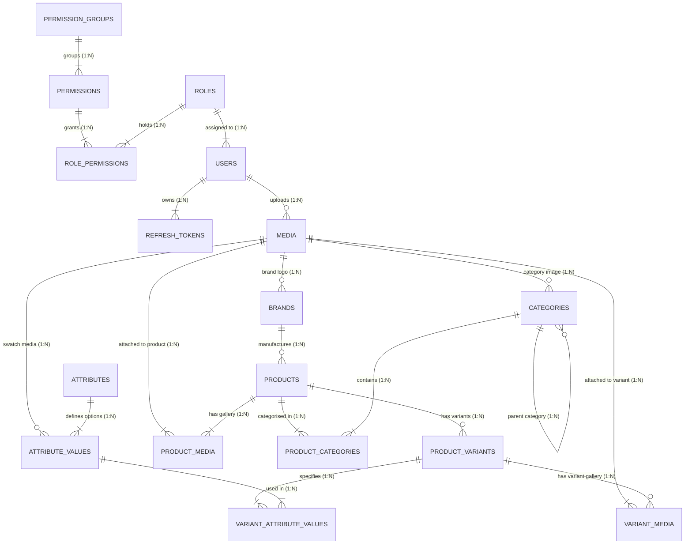

## 1. Entity-Relationship Diagram (ERD)

Code snippet

## 2. Module-by-Module Attribute & Relationship Breakdown

### Modules 2 & 3: Permissions & Roles (RBAC Backbone)

#### `permission_groups`

- **Attributes:**
  - `id` (PK, UUID): Unique identifier.
  - `name` (VARCHAR, Unique): Group/module name (e.g., `Product`, `Media`).
  - `description` (TEXT): Overview of module scope.
- **Relationships:**
  - **1 to Many** with `permissions`: One group defines many `module:action` permissions.

#### `permissions`

- **Attributes:**
  - `id` (PK, UUID): Unique identifier.
  - `groupId` (FK -> `permission_groups.id`, `ON DELETE CASCADE`): Module group.
  - `name` (VARCHAR, Unique): Formatted permission string (`module:action`, e.g., `product:create`).
- **Relationships:**
  - **Many to 1** with `permission_groups`.
  - **Many to Many** with `roles` via `role_permissions`.

#### `roles`

- **Attributes:**
  - `id` (PK, UUID): Unique identifier.
  - `name` (VARCHAR, Unique): Role title (e.g., `Super Admin`, `Catalog Manager`).
  - `status` (ENUM: `active`, `inactive`): Enables/disables entire roles.
- **Relationships:**
  - **Many to Many** with `permissions` via `role_permissions`.
  - **1 to Many** with `users`: A role can be assigned to many users.

#### `role_permissions` (Junction Table)

- **Attributes:**
  - `roleId` (PK, FK -> `roles.id`, `ON DELETE CASCADE`)
  - `permissionId` (PK, FK -> `permissions.id`, `ON DELETE CASCADE`)
- **Relationships:**
  - Resolves the `N:M` relationship between roles and permissions.

### Modules 1 & 4: Users & Authentication

#### `users`

- **Attributes:**
  - `id` (PK, UUID): Unique identifier.
  - `email` (VARCHAR, Unique): Account email (login credential).
  - `password` (TEXT): Argon2/Bcrypt hash (never returned in responses).
  - `roleId` (FK -> `roles.id`, `ON DELETE RESTRICT`): User's single active role.
  - `isActive` (BOOLEAN): Master kill-switch. When `false`, blocks login and token refresh.
- **Relationships:**
  - **Many to 1** with `roles`: Deleting a role in use is blocked by `RESTRICT`.
  - **1 to Many** with `refresh_tokens`.
  - **1 to Many** with `media` (uploader tracking).

#### `refresh_tokens`

- **Attributes:**
  - `id` (PK, UUID): Token record identifier.
  - `userId` (FK -> `users.id`, `ON DELETE CASCADE`): Token owner.
  - `token` (TEXT, Unique): Opaque or JWT refresh token string.
  - `isRevoked` (BOOLEAN): Set to `true` on `/logout` or rotation.
  - `replacedByToken` (TEXT): Audit trail link to detect token reuse attacks.
  - `expiresAt` (TIMESTAMP): Token lifespan limit.
- **Relationships:**
  - **Many to 1** with `users`. Deleting a user purges all active/expired sessions.

### Module 5: Media Asset Library

#### `media`

- **Attributes:**
  - `id` (PK, UUID): Unique asset ID.
  - `publicUrl`, `storedPath`, `fileName`: Location and identity metadata.
  - `mimeType`, `type` (ENUM: `image`, `video`, `document`, `other`): Derived from byte-sniffing.
  - `uploadedBy` (FK -> `users.id`, `ON DELETE SET NULL`): Audit owner.
- **Relationships:**
  - Referenced as **1 to Many** by `categories`, `brands`, and `attribute_values`.
  - Joined in **N to M** with `products` and `product_variants`.
  - _Foreign key policy:_ Other entities use `ON DELETE RESTRICT` pointing to `media.id` so active files cannot be accidentally orphaned or deleted.

### Modules 6 & 7: Taxonomy (Category & Brand)

#### `categories`

- **Attributes:**
  - `id` (PK, UUID): Category ID.
  - `slug` (VARCHAR, Unique): DB-enforced URL path slug.
  - `parentId` (FK -> `categories.id`, `ON DELETE RESTRICT`): Self-referencing link for unlimited nested trees.
  - `imageId` (FK -> `media.id`, `ON DELETE RESTRICT`): Category banner/icon.
- **Relationships:**
  - **Self-Referencing 1 to Many** (`parentId`): One parent category contains many subcategories.
  - **Many to Many** with `products` via `product_categories`.

#### `brands`

- **Attributes:**
  - `id` (PK, UUID): Brand ID.
  - `name`, `slug` (VARCHAR, Unique): Brand name and URL slug.
  - `logoId` (FK -> `media.id`, `ON DELETE RESTRICT`): Brand logo.
- **Relationships:**
  - **1 to Many** with `products`: A brand can manufacture many products.

### Module 8: Flexible Attribute System

#### `attributes`

- **Attributes:**
  - `id` (PK, UUID): Attribute ID.
  - `name`, `slug` (VARCHAR, Unique): e.g., `Color`, `Size`, `Storage`.
  - `type` (ENUM: `dropdown`, `radio`, `checkbox`, `colour_swatch`, `image_swatch`): Controls UI display logic.
- **Relationships:**
  - **1 to Many** with `attribute_values`.

#### `attribute_values`

- **Attributes:**
  - `id` (PK, UUID): Value record ID.
  - `attributeId` (FK -> `attributes.id`, `ON DELETE CASCADE`): Parent attribute definition.
  - `value`, `slug` (VARCHAR): e.g., `Red`, `XL`, `256GB`.
  - `hexCode` (VARCHAR): Optional hex value for `colour_swatch` (`#FF0000`).
  - `mediaId` (FK -> `media.id`, `ON DELETE RESTRICT`): Optional image for `image_swatch`.
- **Constraints & Relationships:**
  - **Composite Unique Index:** `(attributeId, value)` & `(attributeId, slug)`. "Red" can exist under both _Color_ and _Style_, but not twice under _Color_.
  - **Many to Many** with `product_variants` via `variant_attribute_values`.

### Module 9: Product Core & Variant Generation

#### `products`

- **Attributes:**
  - `id` (PK, UUID): Base product ID.
  - `type` (ENUM: `simple`, `variable`): Dictates validation and variant rules.
  - `sku` (VARCHAR, Unique, Nullable): Mandatory for simple products; NULL for variable products.
  - `price`, `salePrice` (NUMERIC): Populated for simple products; NULL for variable products.
  - `brandId` (FK -> `brands.id`, `ON DELETE RESTRICT`): Associated brand.
- **Relationships:**
  - **Many to 1** with `brands`. Deleting a brand with attached products is blocked.
  - **Many to Many** with `categories` via `product_categories`.
  - **Many to Many** with `media` via `product_media`.
  - **1 to Many** with `product_variants`.

#### `product_variants`

- **Attributes:**
  - `id` (PK, UUID): Variant ID.
  - `productId` (FK -> `products.id`, `ON DELETE CASCADE`): Parent variable product.
  - `sku` (VARCHAR, Unique): Specific variant SKU (e.g., `SHIRT-RED-XL`).
  - `price`, `salePrice`, `stockQuantity`: Specific pricing and inventory for this exact combination.
- **Relationships:**
  - **Many to 1** with `products`.
  - **Many to Many** with `attribute_values` via `variant_attribute_values`.
  - **Many to Many** with `media` via `variant_media`.

#### Junction Tables (`product_categories`, `product_media`, `variant_attribute_values`, `variant_media`)

- **Key Attributes & Behavior:**
  - `isThumbnail` (BOOLEAN): Ensures at most one primary thumbnail per product/variant (managed transactionally).
  - `sortOrder` (INTEGER): Controls image gallery display order.
  - **Cascade Policies:** Deleting a product/variant automatically cleans up its junction records (`CASCADE`), while referenced target entities (`media`, `categories`, `attribute_values`) block accidental deletion if attached (`RESTRICT`).

## 3. Key Referential Integrity Rules Summary

| **Primary Table** | **Referenced By**                              | **FK Delete Behavior** | **Assessment Reason**                                                       |
| ----------------- | ---------------------------------------------- | ---------------------- | --------------------------------------------------------------------------- |
| **`roles`**       | `users.roleId`                                 | `RESTRICT`             | Prevents deleting a role assigned to active users (returns `409 Conflict`). |
| **`media`**       | `categories`, `brands`, `products`, `variants` | `RESTRICT`             | Prevents deleting media files currently attached across the store.          |
| **`categories`**  | `categories.parentId`                          | `RESTRICT`             | Prevents orphaning child subcategories.                                     |
| **`brands`**      | `products.brandId`                             | `RESTRICT`             | Prevents leaving products without a valid brand reference.                  |
| **`products`**    | `product_variants.productId`                   | `CASCADE`              | Deleting a base product cleanly removes all its generated variants.         |
